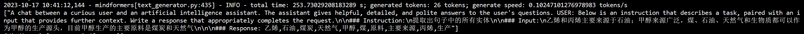
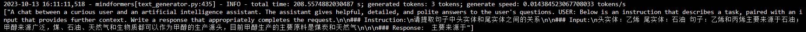

# 欢迎来到知识图谱三元组抽取大模型

# 0. 准备工作
## 0.1 代码结构介绍
  ```bash
  work
      ├── ckpts
            ├── chinese-llama2-tokenizer #添加中文单词后的分词模型
            ├── chinese-tokenizer        #从中文语料库得到的中文分词模型
            ├── llama2-tokenizer         #原始llama2英文分词模型
            ├── llama2-7b-pretrain       #使用添加中文单词的分词模型预训练
            ├── llama2-7b-lora           #预训练基础上进行lora微调
            └── llama2-7b                #原始llama2英文权重
      ├── data
            ├── chinesecorpus            #扩充词表所用中文语料
            ├── medchat                  #眩晕症所用数据
            └── knowledgegraph           #知识图谱所用数据
      └── mindformers
            ├── configs
            ├── mindformers
            ├── output
            ├── scripts
            ├── llama_infer.py
            ├── llama_test.py
            └── run_mindformers.py
  ```

## 0.2 notebook
- 8卡notebook
- 镜像mindformers：mindformers_0.6rc1_mindspore_2_0_modelarts

## 0.3 下载llama2原始英文权重和分词器
```bash
# 本地执行
# 2.0.1 copy /home/ma-user/work/mindformers/mindformers/models/llama/convert_weight.py 到本地
# 2.0.2 下载llama2-7b原始权重
# 2.0.3 安装mindspore 2.0 cpu版本，将pytorch权重转换为mindspore权重文件，并上传到obs
python convert_weight.py --torch_ckpt_dir ./llama2-7b --mindspore_ckpt_path ./llama2-7b/llama2-7b.ckpt

# ModelArts notebook中执行
cd work
mkdir ckpts
cd ckpts
mkdir llama2-tokenizer
mkdir llama2-7b
python /home/ma-user/work/mindformers/mindformers/tools/tokenizer_expand/copy_llama2.py
```
## 0.4 原始数据和训练得到权重文件obs路径
  ```bash
  obs://liuyuanqiu/mindformers/
      ├── ckpts
            ├── llama2-tokenizer                             #原始llama2分词器
            ├── chinese-llama2-tokenizer                     #扩充中文词汇后分词器
            ├── llama2-7b                                    #原始llama2权重
            ├── llama2-7b-pretrain                           #扩充词表预训练后权重
                  ├── llama2_7b_pretrain_rank_0-32000_1.ckpt
                  ├── llama2_7b_pretrain_rank_0-36000_1.ckpt
                  ├── llama2_7b_pretrain_rank_0-40000_1.ckpt
                  ├── llama2_7b_pretrain_rank_0-44000_1.ckpt
                  └── llama2_7b_pretrain_rank_0-48000_1.ckpt
            ├── llama2-7b-lora
                  ├── medchat                                #眩晕症llama2 Lora微调后权重
                        ├── llama2_7b_lora_rank_0-1000_2.ckpt
                        ├── llama2_7b_lora_rank_0-2000_2.ckpt
                        ├── llama2_7b_lora_rank_0-3000_2.ckpt
                        └── llama2_7b_lora_rank_0-4000_2.ckpt
      └── data
            ├── chinese-corpus                               #扩充词表所用中文预料
            └── medchat                                      #眩晕症微调数据
                  ├── 2500_data_v2.json                      #眩晕症原始数据
                  ├── 2500_data_v2_conversation.json         #转换后多轮对话数据
                  └── xuanyun4096.train.mindrecord           #mindrecord格式微调数据
  ```
# 1. 扩充llama词表
## 1.1 中文预料处理
```bash
cd work
mkdir data
cd data
mkdir chinesecorpus
python /home/ma-user/work/mindformers/mindformers/tools/tokenizer_expand/copy_chinese_corpus.py
unzip chinese-corpus-huagong.zip
unzip -d ./comments2019 comments2019.zip
unzip -d ./news2016 news2016zh_corpus.zip
unzip -d ./webtext2019 webText2019zh_corpus2.zip
unzip wiki_zh_2019.zip
```

## 1.2 扩充词表，生成训练数据
```python
cd work/mindformers
# 扩充词表（需要大概8个小时）
python mindformers/tools/tokenizer_expand/tokenizer_expand.py
# 测试扩充后对中文编码能力（扩充后词表大小60730）
python mindformers/tools/tokenizer_expand/tokenizer_test.py
# 将中文预料转化为mindrecord格式
python mindformers/tools/dataset_preprocess/llama/llama_preprocess.py --dataset_type chinesecorpus --input_glob /home/ma-user/work/data/chinesecorpus/corpus_zh_0.txt --model_file /home/ma-user/work/ckpts/chinese-llama2-tokenizer/tokenizer.model --seq_length 4096 --output_file /home/ma-user/work/data/chinesecorpus/corpus_zh_0.mindrecord
```

## 1.3 预训练
```python
# 使用中文语料库预训练（训练wordembedding参数）一轮大概26小时
bash run_distribute.sh /user/config/nbstart_hccl.json /home/ma-user/work/mindformers/configs/llama_ailab/pretrain_llama2_7b.yaml [0,8] train
# 测试
python llama_test.py --model /home/ma-user/work/mindformers/configs/llama_ailab/predict_llama2_7b_pretrain.yaml --tokenizer /home/ma-user/work/ckpts/chinese-llama2-tokenizer --checkpoint_path /home/ma-user/work/ckpts/llama2-7b-pretrain/llama2_7b_pretrain_rank_0-32000_1.ckpt
```

# 2. 化工三元组抽取大模型训练
## 2.1 实体抽取大模型
### 2.1.1 实体抽取数据处理
```python
# 转换为多轮对话模式
python /home/ma-user/work/mindformers/mindformers/tools/dataset_preprocess/llama/alpaca_converter.py --data_path /home/ma-user/work/data/kg/entity_train_1016.json --output_path /home/ma-user/work/data/kg/entity_train_1016_conversation.json
# 将数据转换为mindrecord格式
# 使用llama进行微调时，句子长度seq_length为2048
# 使用llama2进行微调时，句子长度seq_length需要设置为4096
python /home/ma-user/work/mindformers/mindformers/tools/dataset_preprocess/llama/llama_preprocess.py --input_glob /home/ma-user/work/data/kg/entity_train_1016_conversation.json --dataset_type qa --model_file /home/ma-user/work/ckpts/chinese-llama2-tokenizer/tokenizer.model --seq_length 4096 --output_file  /home/ma-user/work/data/kg/entity_4096_1016.train.mindrecord
```
### 2.1.2 llama2 实体提取Lora微调
```python
cd work/mindformers/scripts
# 一轮大概110分钟
bash run_distribute.sh /user/config/nbstart_hccl.json /home/ma-user/work/mindformers/configs/llama_ailab/finetuen_llama2_7b_lora_kg_entity.yaml [0,8] finetune
```
## 2.2 关系抽取大模型
### 2.2.1 关系抽取数据处理
```python
# 转换为多轮对话模式
python /home/ma-user/work/mindformers/mindformers/tools/dataset_preprocess/llama/alpaca_converter.py --data_path /home/ma-user/work/data/kg/rel_train.json --output_path /home/ma-user/work/data/kg/rel_train_conversation.json
# 将数据转换为mindrecord格式
# 使用llama进行微调时，句子长度seq_length为2048
# 使用llama2进行微调时，句子长度seq_length需要设置为4096
python /home/ma-user/work/mindformers/mindformers/tools/dataset_preprocess/llama/llama_preprocess.py --input_glob /home/ma-user/work/data/kg/rel_train_conversation.json --dataset_type qa --model_file /home/ma-user/work/ckpts/chinese-llama2-tokenizer/tokenizer.model --seq_length 4096 --output_file  /home/ma-user/work/data/kg/rel4096.train.mindrecord
```
### 2.2.2 llama2 关系提取Lora微调
```python
cd work/mindformers/scripts
# 一轮大概110分钟
bash run_distribute.sh /user/config/nbstart_hccl.json /home/ma-user/work/mindformers/configs/llama_ailab/finetuen_llama2_7b_lora_kg_rel.yaml [0,8] finetune
```

# 3. 推理
## 3.1 实体抽取推理
```python
cd /home/work/mindformers/
python run_kg.py --type entity --model /home/ma-user/work/mindformers/configs/llama_ailab/finetuen_llama2_7b_lora_kg_entity.yaml --tokenizer /home/ma-user/work/ckpts/chinese-llama2-tokenizer --checkpoint_path /home/ma-user/work/ckpts/llama2-7b-lora/kg_entity/llama2_7b_lora_rank_0_1-333_2.ckpt
```


## 3.2 批量句子实体抽取
```python
# 单卡循环提取
python run_kg.py --type entity --model /home/ma-user/work/mindformers/configs/llama_ailab/finetuen_llama2_7b_lora_kg_entity.yaml --tokenizer /home/ma-user/work/ckpts/chinese-llama2-tokenizer --checkpoint_path /home/ma-user/work/ckpts/llama2-7b-lora/kg_entity/llama2_7b_lora_rank_0_1-333_2.ckpt --input_file /home/ma-user/work/data/kg/sens_1017.json --output_file /home/ma-user/work/data/kg/sens_entity_1017.json
# 8卡并行提取
cd /home/work/mindformers/scripts
bash run_kg_distribute.sh /user/config/nbstart_hccl.json entity /home/ma-user/work/mindformers/configs/llama_ailab/finetuen_llama2_7b_lora_kg_entity.yaml /home/ma-user/work/ckpts/chinese-llama2-tokenizer /home/ma-user/work/ckpts/llama2-7b-lora/kg_entity/llama2_7b_lora_rank_0_1-333_2.ckpt /home/ma-user/work/data/kg/sens_1017.json
```

## 3.3 关系抽取推理
```python
cd /home/work/mindformers/
python run_kg.py --type entity --model /home/ma-user/work/mindformers/configs/llama_ailab/finetuen_llama2_7b_lora_kg_rel.yaml --tokenizer /home/ma-user/work/ckpts/chinese-llama2-tokenizer --checkpoint_path /home/ma-user/work/ckpts/llama2-7b-lora/kg_rel/llama2_7b_lora_rank_0-4000_2.ckpt
```

# 4. Others
```python
# 同时杀死所有线程
ps -ef | grep "python run_mindformer.py" | grep -v grep | awk '{print $2}' | xargs kill -9
```